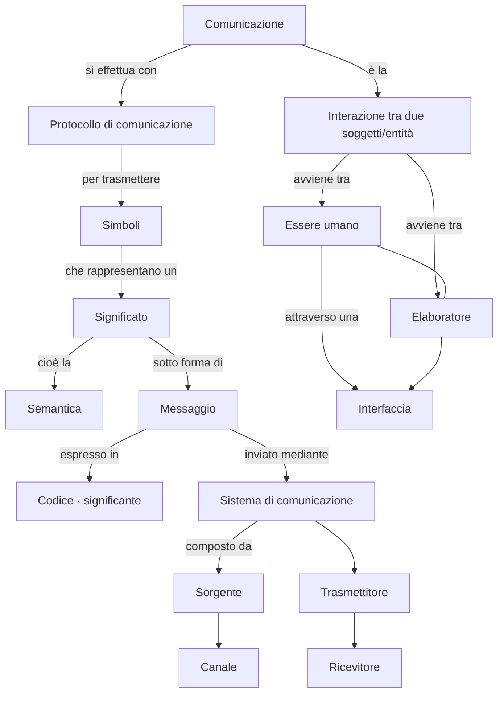

<!-- _class: lead -->

# Unità di Apprendimento 1
## La rappresentazione delle informazioni

### Lezione 1 — Informazione e comunicazione

**TPSI — Classe Terza — Istituto Tecnico Informatico**

---

## In questa lezione impareremo

- che cos'è la **comunicazione** e da quali elementi è composta
- come il **calcolatore** rappresenta e scambia l'informazione
- i concetti di **alfabeto**, **codifica** e **protocollo**
- a distinguere codifiche a **lunghezza fissa** e a **lunghezza variabile**
- che cosa distingue un **disturbo** da un **rumore**

> Obiettivo: al termine della lezione saprai spiegare come due sistemi diversi (un essere umano e un computer, oppure due computer) riescono a "capirsi" scambiandosi informazioni.

---

## Introduzione: perché serve comunicare con il computer

Il computer è un dispositivo elettronico che l'uomo utilizza soprattutto per due caratteristiche:

- **velocità** di elaborazione;
- **capacità di memorizzazione** delle informazioni.

Per sfruttarle, l'utente deve poter **comunicare** con il calcolatore:

- per **istruirlo**, scrivendo e memorizzando programmi;
- per **fornirgli dati** da elaborare;
- per **ricevere i risultati** dell'elaborazione.

<div class="example">

💡 **Esempio pratico**: quando scrivi `stampa("Ciao")` in Python, stai "istruendo" il calcolatore; quando prema Invio, il programma ti restituisce `Ciao` a video — è comunicazione in entrambe le direzioni.

</div>

---

## Il problema di fondo

La comunicazione tra uomo e macchina è **ostacolata dalla natura diversa** dei due sistemi che devono dialogare:

- l'uomo ragiona per **concetti, parole, immagini**;
- il computer elabora solo **segnali elettrici (0 e 1)**.

È quindi necessario un **sistema che si interponga** tra i due e permetta loro di interagire: questo sistema si chiama **interfaccia**.

<div class="example">

💡 **Esempi di interfaccia**: la tastiera e il mouse (dall'uomo alla macchina), lo schermo (dalla macchina all'uomo), un'interfaccia grafica di un'app, il touch screen di un ATM o di un tablet.

</div>

---

## I due livelli della comunicazione

Ogni comunicazione, tra persone o tra sistemi, avviene su **due livelli**, ed entrambi vanno "risolti" perché la comunicazione funzioni:

1. **primo livello — trasmissione dei simboli**: bisogna trovare una "lingua comune" (una codifica condivisa) per rappresentare il messaggio;
2. **secondo livello — trasmissione del significato (semantica)**: il messaggio ricevuto deve contenere davvero tutte le informazioni che il mittente voleva comunicare.

<div class="example">

💡 **Esempio**: se scrivo un messaggio in italiano a chi conosce solo il cinese, il primo livello fallisce (i simboli non sono condivisi). Se invece scrivo in italiano corretto ma uso una frase ambigua, è il secondo livello a fallire (il destinatario capisce qualcosa di diverso da ciò che intendevo).

</div>

---

## Il sistema di comunicazione

Un **sistema di comunicazione** (modello introdotto dal matematico **Claude Shannon**) è composto da:

- una **sorgente di informazione**, che sceglie un messaggio tra i vari possibili;
- il messaggio viene inviato a un **trasmettitore** (o emittente), che lo **codifica** in un segnale;
- il segnale viene inviato tramite un **canale** (es. l'aria per un messaggio verbale);
- un **ricevitore**, al quale giunge infine il segnale, che lo decodifica per il **destinatario**.

```
sorgente --messaggio--> trasmittente --segnale inviato--> canale
   --segnale ricevuto--> ricevitore --messaggio--> destinatario
```

---

## Gli elementi fondamentali della comunicazione

Riassumendo, possiamo individuare sei elementi fondamentali:

| Elemento | Descrizione |
|---|---|
| **messaggio** | segnali ottici, acustici, elettrici ecc. |
| **trasmettitore** | invia il messaggio (telefono, computer, modem…) |
| **ricevitore** | legge e decodifica il messaggio |
| **canale** | mezzo di trasmissione (fili, onde radio, luce) |
| **codice** | simboli usati per adattare il messaggio alla trasmissione |
| **protocollo** | regole che definiscono formato e lunghezza dei messaggi |

Nella prima parte di questa lezione ci concentreremo sulla **codifica del messaggio**.

---

## Esempio guida: comunicare senza parlare

<div class="example">

📌 **Esempio**: durante una verifica a scelta multipla con **quattro distrattori** (A, B, C, D), due compagni vogliono scambiarsi le risposte senza farsi accorgere dal docente, usando dei **simboli gestuali**:

- 👊 pugno chiuso → risposta A
- 🤙 mano a "telefono" → risposta B
- 👍 pollice in su → risposta C
- 🤲 mani a cuore → risposta D

</div>

Qui l'**alfabeto sorgente** è l'insieme delle possibili risposte {A, B, C, D}, mentre l'**alfabeto codice** è l'insieme dei gesti concordati. Useremo proprio questo esempio più avanti per costruire un **protocollo di comunicazione** completo.

---

## Tipologia dell'informazione

Gli elaboratori elettronici trattano diverse categorie di informazione:

- **numeri** e operazioni numeriche;
- **dati alfanumerici** (testo);
- **immagini** e filmati;
- **suoni**.

<div class="example">

💡 Tutte queste categorie, per quanto diverse, all'interno del computer vengono ridotte a **sequenze di bit** (0 e 1): un file di testo, una fotografia e una canzone sono, "sotto il cofano", solo sequenze di simboli binari organizzate secondo regole (codifiche) diverse.

</div>

---

## Significante e significato

Uno stesso **significato** può essere espresso da **significanti** (rappresentazioni) diverse:

| Significante | Codifica | Significato |
|---|---|---|
| **10** | numeri arabi | dieci |
| **X** | numeri romani | dieci |
| ● ● ● ● ● ● ● ● ● ● | numerazione unaria | dieci |

- il **significato** è il **contenuto** dell'informazione, cioè "dieci";
- il **significante** sono le **modalità** con cui il messaggio viene rappresentato tramite simboli.

---

## Messaggio e codifica

- con il termine **messaggio** si intende il **contenuto** dell'informazione, cioè il suo **significato**;
- con il termine **codifica** si intende la **modalità espressiva**, ossia la forma in cui viene scritto il messaggio, cioè il **significante**.

<div class="example">

💡 **Esempio**: il numero dieci (significato/messaggio) può essere scritto come "10" in base decimale, "1010" in binario, oppure "X" in numeri romani: cambia la codifica, non cambia ciò che viene comunicato.

</div>

---

## Codifica: definizione formale

La **codifica** è una tecnica con cui un dato viene rappresentato mediante un insieme definito di **simboli** di qualsiasi natura (grafica, luminosa, acustica ecc.).

Con tali simboli si formano **sequenze** che vengono messe in **relazione biunivoca** con gli elementi da rappresentare (relazione **1 a 1**: a ogni elemento dell'informazione corrisponde una e una sola sequenza di simboli, e viceversa).

<div class="example">

💡 **Esempi di codifiche reali**: l'alfabeto **Morse** (punti e linee per i caratteri), il **numero di matricola** di uno studente, il **codice fiscale**, il **codice a barre** di un articolo, il semaforo (rosso/giallo/verde per regolare un incrocio), lo standard **ASCII** o **Unicode** per rappresentare il testo nei computer.

</div>

---

## Alfabeto sorgente e alfabeto codice

Definiamo due insiemi:

$$T = (x_1, x_2, \dots, x_n)$$

l'**alfabeto sorgente**: l'insieme dei valori da rappresentare (cardinalità **n**).

$$E = (e_1, e_2, \dots, e_k)$$

l'**alfabeto in codice**: l'insieme dei simboli usati per rappresentare le parole dell'alfabeto sorgente (cardinalità **k**).

<div class="example">

💡 **Esempio**: se voglio codificare i giorni della settimana, T = {Lunedì, …, Domenica} è l'alfabeto sorgente (n = 7); se decido di usare solo le cifre binarie, E = {0, 1} è l'alfabeto codice (k = 2).

</div>

---

## Codifica a lunghezza fissa

Secondo la teoria degli insiemi, la **cardinalità** di un insieme A (il numero dei suoi elementi) si indica con **|A|** oppure **card(A)**.

- **T** = alfabeto sorgente, cardinalità **n = |T|**;
- **E** = alfabeto codice, cardinalità **k = |E|**.

Nella codifica a lunghezza fissa, **ogni parola codice ha la stessa lunghezza**:

$$l_i = m = \text{costante}$$

per tutti gli elementi $x_i \in T$: a ognuno corrisponde una delle **$k^m$ disposizioni con ripetizione** dei k simboli di E sugli m posti della sequenza.

---

## Quanto deve essere lunga la parola codice?

Perché **tutti** gli n elementi dell'alfabeto sorgente siano codificabili, serve che:

$$k^m \geq n \quad\Longrightarrow\quad m = \lceil \log_k n \rceil$$

cioè **m** è il più piccolo intero tale che $k^m$ sia almeno pari a n (si arrotonda **per eccesso**).

<div class="example">

📌 **Esempio — i giorni della settimana**

T = {Lunedì, …, Domenica}, cardinalità **n = 7**; E = {A, B}, cardinalità **k = 2**.

Poiché n = 7 e k = 2, serve una lunghezza **m = 3**:

$$m = \lceil \log_2 7 \rceil = 3 \text{ simboli binari}$$

Infatti con m = 2 avremmo solo $2^2 = 4$ combinazioni (insufficienti per 7 giorni), con m = 3 ne abbiamo $2^3 = 8$ (sufficienti, con una di scorta).

</div>

---

## Esempio — i giorni della settimana, passo dopo passo

Con **m = 1** (un solo simbolo, $2^1 = 2$ combinazioni) possiamo dividere i giorni in **2 gruppi**:

- **A**: Lunedì, Martedì, Mercoledì, Giovedì
- **B**: Venerdì, Sabato, Domenica

Con **m = 2** ($2^2 = 4$ combinazioni) possiamo affinare in **4 gruppi**:

- **AA**: Lunedì, Martedì — **AB**: Mercoledì, Giovedì
- **BA**: Venerdì, Sabato — **BB**: Domenica

Con **m = 3** ($2^3 = 8$ combinazioni) possiamo assegnare **una sequenza diversa a ciascun giorno** (7 codici usati su 8 disponibili):

AAA=Lunedì, AAB=Martedì, ABA=Mercoledì, ABB=Giovedì, BAA=Venerdì, BAB=Sabato, BBA=Domenica *(BBB non utilizzato)*

---

## Mettiti alla prova — codifica a lunghezza fissa

<div class="example">

✏️ **Esercizio**

1. Codifica i **mesi dell'anno** utilizzando un alfabeto di due simboli (A, B):
   T = {gennaio, febbraio, …, dicembre}, cardinalità **n = 12**; E = {A, B}, cardinalità **k = 2**.
2. Ripeti la stessa codifica ma con **tre simboli** (A, B, C): E = {A, B, C}, **k = 3**.
3. Cosa osservi confrontando le due codifiche?

</div>

**Soluzione guidata**: con k = 2 serve $m = \lceil \log_2 12 \rceil = 4$ (perché $2^3=8 < 12 \le 2^4=16$); con k = 3 basta $m = \lceil \log_3 12 \rceil = 3$ (perché $3^2=9 < 12 \le 3^3=27$).

→ **più simboli ha l'alfabeto codice, più corte possono essere le parole codice.**

---

## Codice ridondante

Si ha un **codice ridondante** ogni volta che il numero di **parole codice effettivamente usate** è **inferiore** al numero massimo di quelle esprimibili con la combinazione dei simboli ($k^m$).

<div class="example">

💡 **Esempio**: nella codifica dei giorni della settimana con m = 3 e k = 2 abbiamo $2^3 = 8$ combinazioni possibili, ma ne usiamo solo **7**: il codice è quindi **ridondante** (avanza la combinazione "BBB").

La ridondanza non è sempre un difetto: nelle **telecomunicazioni** viene spesso introdotta di proposito per permettere di **rilevare o correggere errori** di trasmissione (è la base dei codici a rilevazione/correzione d'errore, come il bit di parità o i codici CRC).

</div>

---

## Codifica a lunghezza variabile

Nei codici a **lunghezza variabile**, la parola codice ha una lunghezza (numero di simboli) **che varia in funzione del valore da rappresentare**.

Ne sono un esempio:

- l'**alfabeto Morse** (le lettere più frequenti, come E ed A, hanno codici più corti; lettere rare come Q hanno codici più lunghi);
- i **prefissi telefonici** della rete fissa (i numeri delle grandi città sono spesso più corti di quelli dei piccoli centri);
- la codifica **Huffman**, usata nella compressione dei file (es. ZIP, JPEG), che assegna sequenze più corte ai simboli più frequenti.

> 🔎 **Perché conviene?** Se i simboli più usati hanno codici più corti, il messaggio complessivo occupa **meno spazio** in media: è uno dei principi alla base della compressione dei dati.

---

## Confronto: lunghezza fissa vs lunghezza variabile

<div class="example">

📌 **Esempio**: alfabeto sorgente T = {picche, fiori, quadri, cuori}; alfabeto codice E = {\*, /}.

</div>

| Alfabeto sorgente | Lunghezza variabile | Lunghezza fissa |
|---|---|---|
| picche | \* | \*\* |
| fiori | / | // |
| quadri | \*\* | \*/ |
| cuori | // | /\* |

A parità di alfabeto sorgente e alfabeto codice si possono costruire **molti codici diversi**: ogni parola codice può avere lunghezza differente anche **all'interno dello stesso codice** (come nella colonna "lunghezza variabile").

---

## Esempio esteso — i sette nani (+ 2)

<div class="example">

📌 Codifichiamo i nomi dei sette nani con un alfabeto codice a **tre simboli** {A, B, C}, confrontando lunghezza variabile e lunghezza fissa.

</div>

| Sorgente | Var. (v.1) | Var. (v.2) | Fissa |
|---|---|---|---|
| Cucciolo | A | AB | AA |
| Eolo | B | BA | AB |
| Mammolo | C | AC | AC |
| Gongolo | AA | CA | BA |
| Dotto | BB | ABC | BB |
| Pisolo | CC | CBA | BC |
| Brontolo | ABC | BAC | CA |

Con **k = 3** simboli e **n = 7** elementi, la lunghezza fissa minima è $m = \lceil \log_3 7 \rceil = 2$: infatti $3^2 = 9 \ge 7$.

---

## Mettiti alla prova — confronto codifiche

<div class="example">

✏️ **Esercizio**: codifica i **mesi dell'anno** (T, n = 12) con tre diversi alfabeti codice:

a. E = {@, #, \*} → k = 3
b. E = {@, #, \*, =} → k = 4
c. E = {@, #, \*, =, %} → k = 5

Per ciascuno, genera un codice **a lunghezza fissa** e uno **a lunghezza variabile minima**.

</div>

**Suggerimento**: calcola prima $m = \lceil \log_k 12 \rceil$ per ogni valore di k, poi verifica come cambia la lunghezza minima al crescere del numero di simboli disponibili.

---

## Protocollo di comunicazione

Riprendiamo l'esempio dei due alunni che si scambiano le risposte di un test.

Per far funzionare davvero la comunicazione non basta la codifica: serve anche stabilire **quando** cominciare, **cosa** si sta comunicando e **quando** finire:

1. bisogna stabilire il momento in cui iniziare a comunicare: i due soggetti devono essere **sincronizzati**;
2. bisogna indicare a **quale domanda** si sta suggerendo la soluzione;
3. bisogna indicare il **termine** della comunicazione.

Per **protocollo di comunicazione** si intende l'insieme di regole che determina le modalità con cui due soggetti (o apparecchiature) si **scambiano i dati**.

---

## Costruire un protocollo: i segnali di controllo

Stabiliamo dei segnali speciali, oltre ai simboli già usati per le risposte:

| Gesto | Significato |
|---|---|
| 🤝 stretta di mano | inizio comunicazione |
| 👏 mani che si toccano | fine comunicazione |
| 👍 pollice in su | pronto alla ricezione |
| ☝️/✌️ dita alzate | numero della domanda (1, 2, 3…) |

Il messaggio ora è composto da **più parti in sequenza**:

1. **inizio comunicazione**;
2. **numero quesito – soluzione al quesito** (ripetuto per ogni domanda);
3. **termine comunicazione**.

---

## Simulazione completa del protocollo

Mittente e destinatario eseguono questa sequenza di gesti concordati:

**Mittente**: 🤝 (inizio) → ☝️☝️ (domanda 2) → 👍 (risposta C) → ✌️✌️✌️ (domanda 3) → 🤙 (risposta B) → 👏 (fine)

**Destinatario**: 👍 (pronto a ricevere)

Traducendo in linguaggio naturale il dialogo diventa:

> **Mittente**: «Sei pronto a ricevere?»
> **Destinatario**: «Ok, inizia la comunicazione.»
> **Mittente**: «Domanda 2 → risposta C, domanda 3 → risposta B, fine comunicazione.»

Questo è, in miniatura, **esattamente ciò che fanno due computer** quando stabiliscono una connessione di rete: handshake iniziale, scambio dati strutturato, chiusura della connessione (pensa al **three-way handshake** del protocollo TCP).

---

## Cenni sulla trasmissione: disturbo e rumore

Durante la trasmissione di un segnale può accadere che l'informazione venga alterata. Si distingue tra:

- **disturbo**: ha caratteristiche **prevedibili** e quindi **eliminabili** (es. un'interferenza periodica nota, che si può filtrare);
- **rumore**: ha caratteristiche **non prevedibili**, quindi **non completamente eliminabile** (es. il rumore termico dei componenti elettronici).

Non esistono limiti **tecnici** nella riduzione dei disturbi, ma solo limiti **temporali ed economici**: quanto più si vuole ridurre l'errore, tanto più **lunga e costosa** deve essere la codifica (es. aggiungendo simboli di controllo o ridondanza).

<div class="example">

💡 **Esempio quotidiano**: una telefonata che "gracchia" per un cavo difettoso (disturbo prevedibile, risolvibile sostituendo il cavo) è diversa da un rumore di fondo casuale in una chiamata in vivavoce (rumore, mai eliminabile del tutto, solo attenuabile).

</div>

---

## Mappa concettuale riassuntiva



*(Se il renderer non supporta Mermaid, questo schema riepiloga: Comunicazione → Protocollo → Simboli → Significato/Messaggio → Codice e Sistema di comunicazione; e Comunicazione → Interazione uomo-macchina → Interfaccia).*

---

## Che cosa abbiamo imparato

- il concetto di **comunicazione**;
- lo schema base di un **sistema di comunicazione**, sviluppato dal matematico **Claude Shannon**;
- le **categorie** di informazioni trattate dagli elaboratori elettronici;
- in cosa consiste la **codifica** di un messaggio;
- la differenza tra **significante** e **significato**;
- i concetti di **alfabeto**, **codifica** e **protocollo**;
- le tecniche di codifica in base alla **lunghezza** delle parole codice (fissa/variabile);
- le caratteristiche dei **codici ridondanti**;
- la differenza tra **disturbo** e **rumore**.

---

## Ora prova tu a rispondere

- In cosa consiste la comunicazione?
- Cos'è un sistema di comunicazione?
- Disegna lo schema di un sistema di comunicazione.
- Cosa si intende con il termine *messaggio*?
- Cosa si intende con il termine *codifica*?
- Quando un codice è ridondante?
- Quali sono le tipologie delle lunghezze delle parole codice?
- Qual è la differenza tra codice a lunghezza fissa e a lunghezza variabile?
- In cosa consiste un protocollo di comunicazione?

---

## Verifica — Vero o Falso

1. Con *interfaccia* si definisce il dispositivo che permette a due generici elementi di interagire. **V/F**
2. Con *protocollo di comunicazione* si intende la modalità con cui due entità comunicano. **V/F**
3. Un protocollo è l'insieme delle regole che definiscono il formato dei messaggi stessi. **V/F**
4. Il significante denota il significato. **V/F**
5. L'insieme dei valori da rappresentare prende il nome di alfabeto sorgente. **V/F**
6. L'insieme dei simboli utilizzati per rappresentare le parole dell'alfabeto sorgente si chiama alfabeto in codice. **V/F**

---

## Verifica — Vero o Falso (continua)

7. Le rappresentazioni "più lunghe" si ottengono con gli alfabeti "più ricchi" di simboli. **V/F**
8. In un codice ridondante si ha un numero di simboli uguale al numero massimo di quelli esprimibili con la combinazione dei simboli. **V/F**
9. Un disturbo ha caratteristiche prevedibili e quindi eliminabili. **V/F**
10. Un rumore ha caratteristiche prevedibili e quindi eliminabili. **V/F**

> 🔑 **Suggerimento**: rileggi gli slide su "codice ridondante" e "disturbo/rumore" per verificare le affermazioni 7, 8 e 10 — sono le più insidiose!

---

## Verifica — Scelta multipla (1/2)

**1. Quale tra i seguenti non è un elemento fondamentale di un sistema di comunicazione?**
a) Messaggio b) Trasmettitore c) Ricevitore d) Canale e) Codice f) Alfabeto g) Protocollo

**2. Una "codifica" produce:**
a) una sequenza di simboli dell'alfabeto codice
b) una sequenza di simboli dell'alfabeto sorgente
c) una sequenza qualunque di simboli da trasmettere
d) nessuna delle definizioni precedenti

**3. Nella codifica a lunghezza fissa:**
a) le parole dell'alfabeto sorgente hanno lunghezza costante
b) le parole dell'alfabeto codice hanno lunghezza costante
c) i caratteri dell'alfabeto sorgente hanno lunghezza costante
d) i caratteri dell'alfabeto codice hanno lunghezza costante

---

## Verifica — Scelta multipla (2/2)

**4. Cosa si intende per protocollo di comunicazione?**
a) Un insieme di regole per l'invio dei dati
b) Un insieme di regole per la ricezione dei dati
c) Un insieme di regole che determinano le modalità con cui due entità si scambiano i dati
d) Un insieme di regole che determinano le modalità con cui due entità interpretano i dati

**5. Quale componente non appartiene al protocollo di comunicazione?**
a) Segnale di inizio comunicazione b) Segnale di fine comunicazione
c) Segnale di sincronismo d) Segnale di errore nella trasmissione e) Strutturazione del messaggio

**6. Quando un codice si dice ridondante?**
a) Se ha parole codice duplicate
b) Se il numero di parole codice è inferiore al massimo esprimibile
c) Se il numero di parole codice è uguale al massimo esprimibile
d) Se il numero di parole codice è superiore al massimo esprimibile

---

## Esercizi finali

1. Avendo T = {Cucciolo, Eolo, …, Mammolo, Biancaneve, cacciatore} ed E = {A, B, C}, individua **due codici** che rappresentino i sette nani più Biancaneve e il cacciatore (9 elementi).

2. Codifica i nomi dei primi 12 elementi della tavola periodica con un alfabeto composto da:
   a) 4 simboli: \$, €, #, X   b) 5 simboli: \$, €, #, &, X
   Per ciascuno, trova un codice a lunghezza fissa minima e uno a lunghezza variabile minima.

3. Costruisci un sistema di codifica con **cinque simboli**: scrivi le prime 16 parole codice e indica il numero massimo di elementi sorgente rappresentabili.

4. Sul pianeta immaginario "Marte" esistono 300 simboli nell'alfabeto sorgente: qual è la lunghezza minima di ogni parola codice (lunghezza fissa) usando solo **due** simboli nell'alfabeto in codice?

5. L'alfabeto A1 contiene i simboli {@, #, §}: quante informazioni posso codificare con parole di lunghezza 4? Prova a codificarne 10.

6. L'alfabeto A2 contiene i simboli {a, b, c, d}: quante informazioni posso codificare con parole di lunghezza 3? Prova a codificarne 12.

---

<!-- _class: lead -->

# Fine Lezione 1

### Prossima lezione: dai sistemi di numerazione alla codifica binaria dell'informazione

**Domande?**