<!-- _class: title -->
<!-- _paginate: false -->
<!-- _header: '' -->
<!-- _footer: '' -->

# La multimedialità: immagini raster e vettoriali

## Unità di Apprendimento 1 · Lezione 6
### La rappresentazione delle informazioni

Tecnologie e Progettazione di Sistemi Informatici e di Telecomunicazioni (TPSI)
Classe 3ª – Istituto Tecnico Informatico

---

## In questa lezione impareremo

1. La **rappresentazione delle immagini in binario** (bianco e nero, grigi, colori)
2. **Risoluzione, definizione e peso** di un'immagine (PPI e DPI)
3. Gli **schermi SD e HD** e i video interlacciati/progressivi
4. La **compressione** delle immagini (lossless e lossy, RLE, JPEG)
5. Le **immagini vettoriali** e il confronto con quelle raster

---

## Introduzione: non solo lettere e numeri

Lettere e numeri **non** sono gli unici dati usati dagli elaboratori. Sempre più applicazioni elaborano anche altri tipi di informazione:

- **immagini**
- **suoni**
- **filmati**

In questi casi si parla di applicazioni di tipo **multimediale**.

**Esempi:** una foto sul telefono, un brano su Spotify, un video su YouTube, un videogioco: dietro a tutto ci sono **sequenze di bit**.

---

## Fedeltà della conversione digitale

A seconda della **tecnica** usata nella conversione in digitale otteniamo risultati più o meno **"fedeli"** all'originale analogico.

<div class="center">

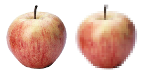

</div>

Il primo formato è **perfettamente identico** all'immagine analogica; nel secondo si nota che durante la conversione si sono **perse delle informazioni** (si vedono i quadratini).

---

## Immagini digitali: le due fasi

Per digitalizzare un'immagine (pittorica o grafica) bisogna trasformare l'immagine analogica — un insieme **continuo** di informazioni di luce e colore **in due dimensioni** — in un insieme di parti **distinte**, codificabili come numeri (**discretizzazione**).

1. **Campionamento**: l'immagine viene suddivisa in tanti piccoli quadrati (**pixel**)
2. **Quantizzazione**: a ogni pixel viene assegnato un **numero** (colore o tonalità)

<div class="box">

È lo stesso procedimento visto nella lezione 2 per i segnali audio: prima si "legge" a intervalli regolari, poi si approssima il valore.

</div>

---

## I due formati digitali

<div class="cols">
<div>

### Raster (o bitmap)
L'immagine è una **griglia di pixel**, ciascuno con il suo colore.

<div class="center">


</div>

Ingrandendo si vedono i **quadratini**.

</div>
<div>

### Vettoriale
L'immagine è descritta da **forme geometriche** (linee, curve, riempimenti).

<div class="center">


</div>

Ingrandendo i bordi restano **nitidi**.

</div>
</div>

---

<!-- _class: section-break -->

# 1. Immagini raster

---

## Campionamento: la griglia di pixel

Si sovrappone idealmente all'immagine una **griglia fittissima** di minuscole celle chiamate **pixel** (*picture element*).

<div class="center">

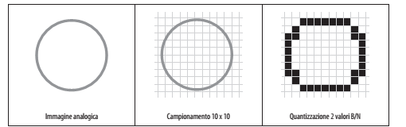

</div>

Da sinistra: **immagine analogica** → **campionamento 10 × 10** → **quantizzazione a 2 valori** (bianco/nero).

---

## Quantizzazione e tavolozza

**Quantizzazione:** si codificano i pixel associando a ogni punto un **numero**.

Quel numero corrisponde, mediante una **tabella di corrispondenza** (detta **tavolozza** o *palette*), a:

- **colori diversi**, oppure
- **sfumature diverse** di un particolare colore

**Esempio:** in una tavolozza da 4 elementi, il numero `2` (binario `10`) potrebbe significare "verde", il `3` (`11`) "blu"…

---

## Bianco e nero: 1 bit per pixel

Codifichiamo ogni singolo pixel con **un bit**:

- **0** se nel pixel il colore predominante è il **bianco**
- **1** se nel pixel il colore predominante è il **nero**

<div class="center">

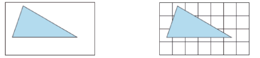

</div>

Un pixel "misto" (metà bianco, metà nero) viene approssimato dal colore **predominante**: per questo il triangolo diventa a "scalini".

---

## Dalla griglia alla sequenza di bit

Stabiliamo un **ordinamento** tra i pixel (es. dal basso a sinistra, riga per riga) per salvare l'immagine come **sequenza di bit**:

<div class="center">

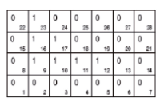

</div>

Leggendo le righe dal basso verso l'alto:

<div class="center">

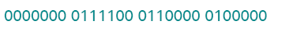

</div>

Griglia 7 × 4 = **28 bit** (3,5 byte).

---

## Ricostruire l'immagine

Facciamo il procedimento **inverso**: dall'immagine memorizzata in bit ricostruiamo l'immagine nella griglia.

<div class="center">

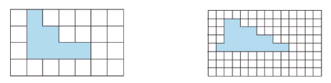

</div>

- **I codifica:** griglia 7 × 4 = **28 bit**
- **II codifica:** griglia 14 × 8 = **112 bit**

**Attenzione:** per ricostruire l'immagine serve conoscere **larghezza e altezza** della griglia, non solo la sequenza di bit!

---

## Più pixel, più qualità

All'aumentare del **numero di pixel** aumenta la **qualità** dell'immagine (definizione).

<div class="box">

**Definizione di un'immagine:** il numero di pixel utilizzati per rappresentarla. Più è alta la definizione, maggiore è la qualità.

</div>

In generale si usano multipli dei pixel, come il **Megapixel** (1 Mpx = 1 milione di pixel).

**Esempio:** una fotocamera da 12 Mpx produce immagini di circa 4000 × 3000 pixel (4000 × 3000 = 12 000 000).

---

## Livelli di grigio

Con **1 bit per pixel** si codificano solo immagini **senza tonalità**: il pixel è o bianco o nero.

Per rappresentare i **grigi** (i livelli di chiaroscuro) servono **più bit per pixel**:

| Bit per pixel | Toni di grigio |
|:---:|:---:|
| 1 | 2 (bianco, nero) |
| 2 | 4 |
| 4 | **16** |
| 8 | **256** |

In generale con *n* bit si hanno **2ⁿ** toni.

---

## Quanti bit per il grigio?

- Per le immagini in **scala di grigio** bastano **8 bit per pixel**: l'occhio umano difficilmente distingue più di 256 livelli
- Nelle applicazioni **biomediche e professionali** (radiografie, TAC) si usano più bit per pixel (**10 o 12**) per non perdere dettagli

**Esempio:** un'immagine 800 × 600 in 256 grigi pesa 800 × 600 × 1 byte = **480 000 byte** (≈ 469 KiB).

---

## Esempio con tre valori

Digitalizziamo un disegno geometrico usando **tre valori** invece di due (perché ci sono **due tonalità di grigio** diverse più il bianco):

<div class="center">

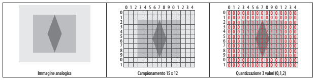

</div>

Valori usati: **0** (bianco), **1** e **2** (due grigi). Ogni pixel ha un numero da 0 a 2 → servono **2 bit** per pixel (anche se il valore 3 non è usato).

---

<!-- _class: section-break -->

# 2. Immagini a colori

---

## Modelli cromatici

Per codificare le immagini a colori si assegna a ogni pixel un **colore** o una sua sfumatura.

Il colore si ottiene da **almeno tre colori di base** (**primari**) secondo un **modello cromatico**:

- **RGB**: rosso (*Red*), verde (*Green*), blu (*Blue*)
- **CMYK**: ciano (*Cyan*), magenta (*Magenta*), giallo (*Yellow*), nero (*Key/black*)

**Esempio:** il giallo su schermo RGB = rosso + verde. In stampa CMYK = ciano assente, magenta 0, giallo 100%.

---

## Sintesi additiva e sottrattiva

<div class="cols">
<div>

### RGB – sintesi **additiva**
- si **sommano** luci colorate
- R + G + B = **bianco**
- ideale per gli **schermi** (colori brillanti e saturi)
- il file RGB è **più piccolo del 25%** del CMYK (3 canali invece di 4)

</div>
<div>

### CMYK – sintesi **sottrattiva**
- si **sovrappongono** inchiostri che assorbono la luce
- C + M + Y ≈ **nero**
- ideale per la **stampa** ad alta qualità
- in tipografia si stampa più volte lo stesso file, un colore alla volta

</div>
</div>

---

## Confronto: additiva (RGB) e sottrattiva (CMYK)

<div class="center">

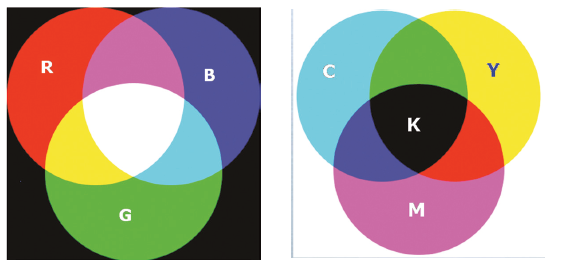

</div>

**A sinistra** (RGB): dove si sovrappongono le luci si schiarisce, al centro compare il **bianco**.
**A destra** (CMYK): dove si sovrappongono gli inchiostri si scurisce, al centro compare il **nero (K)**.

---

## Il modello RGB: 24 bit per pixel

Nel metodo RGB si associano **256 livelli** a ciascun colore, quindi **8 bit per colore**, per un totale di **24 bit**:

- **8 bit (1 byte)** per il **rosso** [0–255]
- **8 bit (1 byte)** per il **verde** [0–255]
- **8 bit (1 byte)** per il **blu** [0–255]

<div class="center">

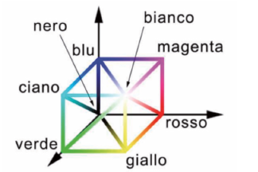

</div>

Colori possibili: 256 × 256 × 256 = 2²⁴ = **16 777 216** (*True color*).

---

## Esempi di colori RGB

| Colore | R | G | B | Esadecimale |
|---|:---:|:---:|:---:|:---:|
| Nero | 0 | 0 | 0 | `#000000` |
| Bianco | 255 | 255 | 255 | `#FFFFFF` |
| Rosso | 255 | 0 | 0 | `#FF0000` |
| Giallo | 255 | 255 | 0 | `#FFFF00` |
| Grigio medio | 128 | 128 | 128 | `#808080` |
| Arancione | 255 | 136 | 0 | `#FF8800` |

Un colore RGB si scrive con **3 byte = 6 cifre esadecimali** (una coppia per canale). Ecco perché la lezione 5 (basi 2, 8, 16) serve davvero!

---

## Una fotografia scomposta in R, G, B

Una fotografia RGB si può scomporre nei suoi tre **canali** (componenti dei colori primari):

<div class="center">

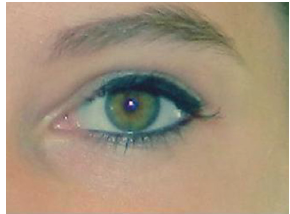

</div>

<div class="center">

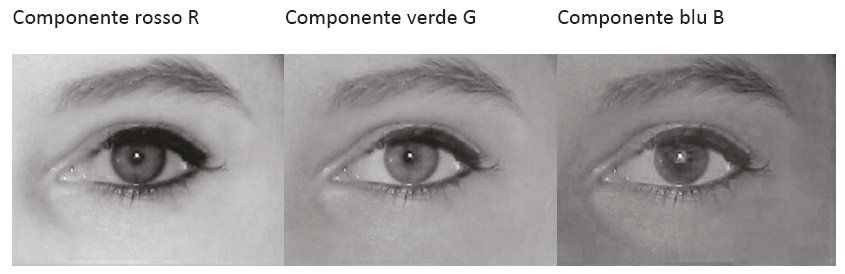

</div>

Ogni canale è una **immagine in scala di grigio a 8 bit**: più chiaro = più intensità di quel colore.

---

## Le tre componenti a colori

<div class="center">

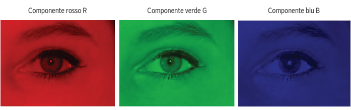

</div>

Sovrapponendo (sommando) le tre componenti si ricostruisce la fotografia a colori originale.

---

## Palette di colori

Con **palette** si intende la gamma di colori in dotazione, che può essere quella della **scheda grafica** di un computer oppure quelli disponibili per realizzare un disegno o una fotografia.

**Esempio:** usiamo solo **4 colori RGB** e costruiamo una **tavolozza**:

| Indice | Colore (R G B) | Codice |
|:---:|:---:|:---:|
| 1 | 81 12 D4 (viola) | `00` |
| 2 | 44 D6 D5 (azzurro) | `01` |
| 3 | 3E 52 18 (verde scuro) | `10` |
| 4 | 1B BC AA (verde acqua) | `11` |

Ogni colore si rappresenta con **soli 2 bit** invece di 24.

---

## Esempio di tavolozza a 4 colori

<div class="center">

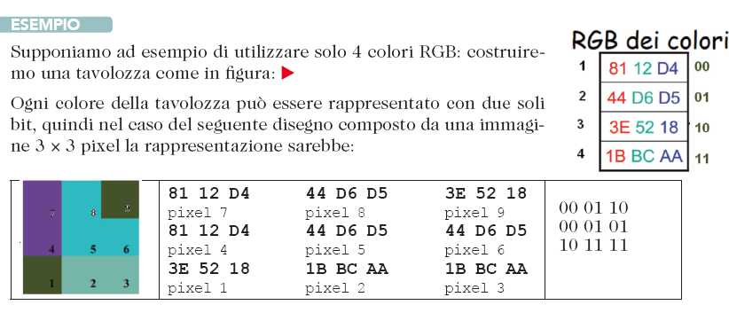

</div>

Un'immagine di **3 × 3 pixel** con questa tavolozza si codifica con:
9 pixel × 2 bit = **18 bit**, contro 9 × 24 = **216 bit** in True color!

*Il "prezzo" da pagare:* si possono usare solo 4 colori.

---

## Profondità di colore

Il **numero di bit** utilizzati per codificare il colore di un singolo pixel prende il nome di **profondità di codifica** (o **profondità di colore**).

<div class="center">

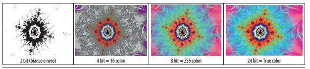

</div>

| Bit per pixel | Colori | Nome |
|:---:|:---:|---|
| 1 | 2 | bianco e nero |
| 4 | 16 | |
| 8 | 256 | |
| 16 | 65 536 | *High color* |
| 24 | 16 777 216 | *True color* |

---

<!-- _class: section-break -->

# 3. Risoluzione e peso

---

## Risoluzione: PPI e DPI

Come unità di misura della **risoluzione** viene utilizzato il **pixel**, con due riferimenti diversi:

- **a video** → **PPI**, *Pixels Per Inch* (pixel per pollice)
- **in stampa** → **DPI**, *Dots Per Inch* (punti per pollice)

<div class="box">

Il **pollice** (*inch*) è un'unità di misura anglosassone che vale **2,54 cm**.
La risoluzione è la **densità di pixel**: il numero di punti contenuti su una linea lunga un pollice.

</div>

**Esempi:** i primi computer avevano **72 PPI**; oggi un iPhone 13 ha **458 PPI**!

---

## Definizione e risoluzione: la stessa immagine

Fotografia di un'aquila in **256 toni di grigio**, con **quattro diverse definizioni** (256 × 256, 128 × 128, 32 × 32, 16 × 16 pixel):

<div class="center">

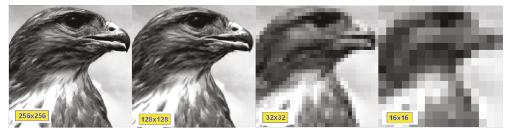

</div>

La risoluzione influenza la **grandezza** dell'immagine:
- a parità di pixel, **aumentando la risoluzione diminuisce la grandezza**
- a parità di grandezza, **aumentando la risoluzione aumentano i pixel**

---

## Peso di un'immagine

Con il termine **peso** si intende l'**occupazione di memoria** di un'immagine.

Per calcolarlo bisogna conoscere il **numero di pixel** (dimensione) e la **profondità di colore**:

<div class="box" style="text-align:center;">

**Peso (bit) = larghezza × altezza × profondità (bit per pixel)**
**Peso (byte) = peso (bit) / 8**

</div>

**Esempio: 640 × 480 in True color**
- pixel: 640 × 480 = **307 200**
- peso di ogni pixel: 3 byte (1 per componente RGB)
- peso dell'immagine: 307 200 × 3 = **921 600 byte** = 900 KiB

---

## Altri esempi di peso

| Immagine | Calcolo | Peso |
|---|---|:---:|
| 100 × 100, B/N (1 bit) | 10 000 × 1 / 8 | **1 250 B** |
| 800 × 600, 256 grigi | 480 000 × 1 | **480 000 B** ≈ 469 KiB |
| 1920 × 1080, True color | 2 073 600 × 3 | **6 220 800 B** ≈ 5,9 MiB |
| Foto 12 Mpx, True color | 12 000 000 × 3 | **36 MB** (non compressa) |

Ecco perché servono i **formati compressi** (lo vedremo più avanti)!

---

## Tabella: definizione, profondità e peso

<div class="center">

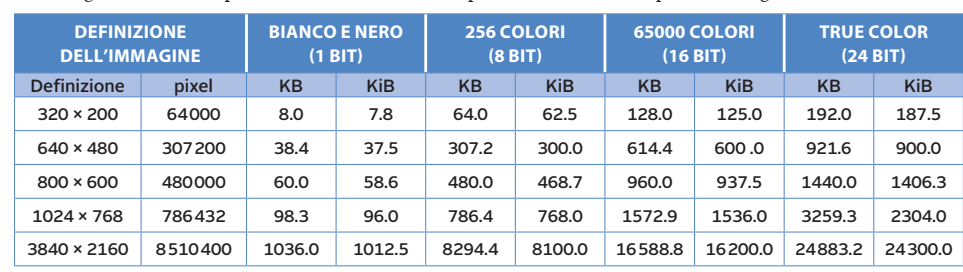

</div>

Occupazione di memoria in **KB** (1 000 byte) e **KiB** (1 024 byte) per alcune situazioni tipiche, al variare della definizione e del numero di colori.

---

## Risoluzione grafica

La **qualità** di un'immagine è legata:

- al **numero di pixel** usati per la sua rappresentazione
- al **numero di colori**
- alla sua **dimensione**, indicata in **pollici** (*inch*)

<div class="box">

Definiamo **risoluzione grafica** la **qualità** con la quale un'immagine è rappresentata.

</div>

*Il pollice è un'unità di misura anglosassone: 1 in = 2,54 cm, quindi 1 cm ≈ 0,3937 in.*

---

## Densità di pixel: 72 PPI e 300 PPI

Come unità di misura della risoluzione si usa la **densità di pixel**, cioè il numero di punti su una linea lunga **un pollice**.

<div class="center">

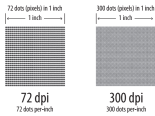

</div>

A parità di superficie (1 pollice), **più punti** → **maggiore nitidezza** e dettaglio.

---

## Zoom con PPI differenti

La stessa immagine a **72 PPI** e a **300 PPI**; lo zoom interno è al **200%**:

<div class="center">

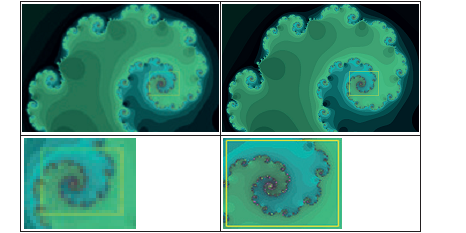

</div>

A 72 PPI ingrandendo si vedono i **pixel**; a 300 PPI l'immagine resta **dettagliata**.

---

## Risoluzione e dimensione: tabella

Relazione tra **occupazione di memoria**, **dimensioni fisiche** e **risoluzioni** in alcune situazioni tipiche (stampa 6 × 4 pollici, cioè 15 × 10 cm):

<div class="center">

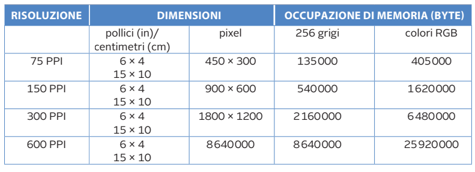

</div>

**Esempio di calcolo:** 6 in × 300 PPI = 1800 pixel · 4 in × 300 PPI = 1200 pixel → **1800 × 1200 pixel**.

---

## A parità di pixel: 72 → 320 PPI

Aumentando la risoluzione da **72 PPI a 320 PPI** con **gli stessi pixel** (320 × 320), l'immagine diventa **più piccola** nelle dimensioni fisiche:

<div class="center">

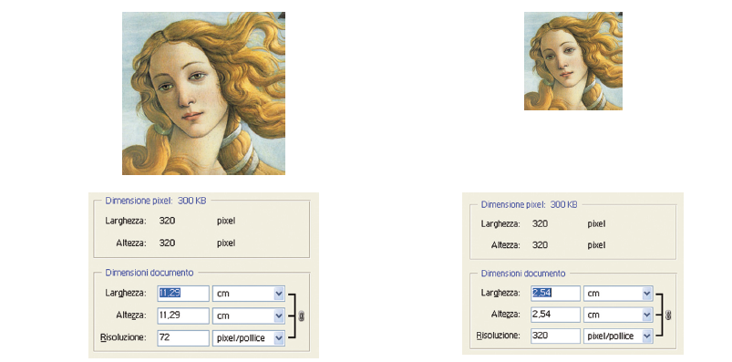

</div>

Larghezza fisica = pixel / PPI → 320/72 ≈ **4,4 in** contro 320/320 = **1 in**.

---

## A parità di grandezza: 36 → 150 PPI

A **parità di dimensione fisica**, aumentando la risoluzione da **36 PPI a 150 PPI** aumentano i **pixel** (e quindi il peso):

<div class="center">

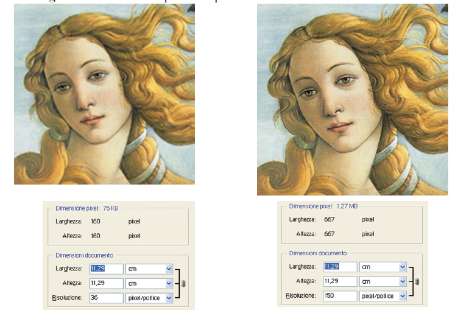

</div>

---

## Risoluzione a video ≠ risoluzione di stampa

La risoluzione di un'immagine **a video** non va confusa con la risoluzione di **stampa**: questo secondo parametro determina il numero di **punti di stampa** per unità di lunghezza, espresso in **DPI**.

A **parità di dimensione stampata**, più punti per pollice → risoluzione più alta e immagine più **nitida**.

<div class="center">


</div>

---

## Quanti DPI servono in stampa?

La risoluzione dell'immagine da stampare **non è di solito superiore a 300 DPI**, perché è legata alla **risoluzione dell'occhio umano**.

**Maggiore è la distanza di lettura** della stampa, **minore** è la risoluzione richiesta.

<div class="center">

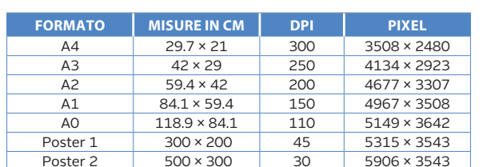

</div>

**Esempi:** un foglio A4 si stampa a 300 DPI (3508 × 2480 pixel), un poster 3 × 2 m guardato da lontano si accontenta di 45 DPI.

---

<!-- _class: section-break -->

# 4. Schermi SD, HD e video

---

## Schermi SD e HD

La principale differenza tra gli schermi **SD** e **HD** è il **rapporto tra le dimensioni** (*aspect ratio*):

- **SD**, *Standard Definition* → rapporto **4:3**
- **HD**, *High Definition* → rapporto **widescreen 16:9**

```text
   4:3 (SD)              16:9 (HD)
 ┌──────────┐        ┌────────────────┐
 │          │        │                │
 │          │        │                │
 └──────────┘        └────────────────┘
```

**Esempio:** i vecchi televisori a tubo catodico erano 4:3; TV, monitor e smartphone attuali sono 16:9.

---

## Le sigle di definizione

Le caratteristiche di definizione si indicano con una sigla **numero + carattere**. Il numero indica sempre la **definizione verticale** (pixel in verticale).

<div class="center">

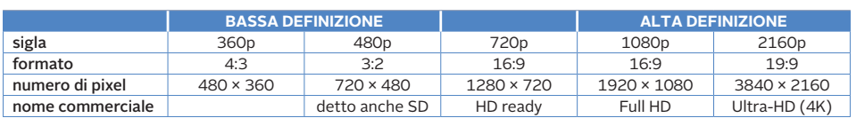

</div>

| Sigla | Pixel | Nome commerciale |
|:---:|:---:|---|
| 480p | 720 × 480 | SD |
| 720p | 1280 × 720 | HD ready |
| 1080p | 1920 × 1080 | **Full HD** |
| 2160p | 3840 × 2160 | Ultra-HD (**4K**) |

---

## Confronto grafico tra le definizioni

Le dimensioni fisiche che dovrebbero avere gli schermi in base al **numero di pixel**:

<div class="center">

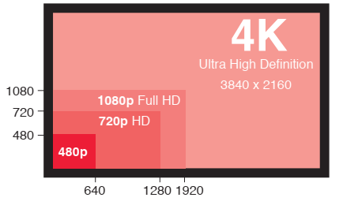

</div>

Il 4K contiene **4 volte** i pixel del Full HD: 3840 × 2160 = 8 294 400 contro 1920 × 1080 = 2 073 600.

---

## Scansione interlacciata e progressiva

Esistono due tipi di **scansione** delle immagini per i filmati:

1. **scansione interlacciata** (**i**)
2. **scansione progressiva** (**p**)

Il carattere **"p"** in 480p, 720p, 1080p indica la scansione **progressiva**; il carattere **"i"** in 480i, 720i, 1080i indica formati **interlacciati**.

**Interlacciata:** le linee di scansione sono divise in **due parti** (linee **dispari** e linee **pari**), mostrate **alternativamente**. Era usata soprattutto nelle **trasmissioni televisive analogiche**.

---

## Come funziona l'interlacciamento

<div class="center">

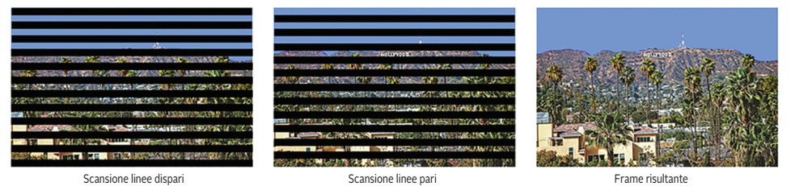

</div>

Il fotogramma finale (a destra) nasce dalla **somma** dei due semiquadri: linee dispari + linee pari.
Con la **progressiva** ogni fotogramma viene mostrato **intero**, riga dopo riga.

**Vantaggio dell'interlacciata:** meno dati da trasmettere.
**Svantaggio:** effetti di "pettine" con oggetti in movimento veloce.

---

## Differenza visiva

Un fotogramma con scansione **interlacciata** (a sinistra) e **progressiva** (a destra):

<div class="center">

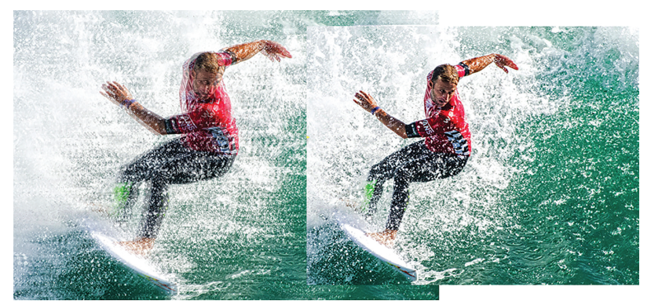

</div>

Nell'interlacciato, gli oggetti in movimento (come il surfista) mostrano bordi "**seghettati**".

---

<!-- _class: section-break -->

# 5. Compressione delle immagini

---

## Perché comprimere?

Per ovviare alla grande **occupazione di memoria** si sono sviluppati **formati compressi**, in grado di ridurre notevolmente il numero di kbyte utilizzati.

Due metodi fondamentali:

- **lossless**: **senza perdita** di informazione
- **lossy**: **con perdita** di informazione (è il più utilizzato)

<div class="box">

**Esempio:** una foto da 12 Mpx non compressa pesa 36 MB, ma in JPEG può pesare 3–5 MB.

</div>

---

## Compressione lossless

Il primo metodo si applica a **qualunque tipo di informazione** rappresentata in binario.

- Si basa sul **riconoscimento delle sequenze di bit** che si ripetono con maggiore o minore frequenza
- Le sequenze più frequenti vengono **sostituite con codifiche più corte**, per risparmiare spazio
- L'informazione originale si può **ricostruire perfettamente**

**Dove si usa:** compressori **WinZIP**, **WinRAR**, e immagini in formato **GIF, PNG, TIFF**.

**Esempio:** nella parola `"AAAAAAAABBB"` conviene scrivere `8A3B`.

---

## Un algoritmo: RLE

**RLE** (*Run-Length Encoding*) sostituisce ogni sequenza di byte di valore identico con **due soli byte**: il **numero di ripetizioni** e il **valore**.

| Originale | Compresso |
|---|---|
| `AAAAABBBCCD` | `5A 3B 2C 1D` |
| `0000000011110000` | `8×0 4×1 4×0` |

**Ottimo** per immagini con **grandi aree uniformi** (loghi, disegni, schemi).
**Sconsigliato** per fotografie: se non ci sono ripetizioni la codifica può addirittura **aumentare** la dimensione (`ABCD` → `1A1B1C1D`).

---

## RLE su un'immagine: esempio

<div class="center">

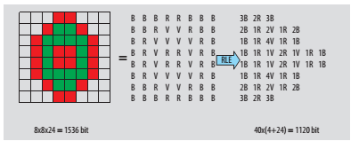

</div>

- Senza compressione: 8 × 8 pixel × 24 bit = **1536 bit**
- Con RLE: 40 sequenze × (4 bit per il contatore + 24 bit per il colore) = 40 × 28 = **1120 bit**

Risparmio: (1536 − 1120) / 1536 ≈ **27%**, **senza perdere nulla** (B = bianco, R = rosso, V = verde).

---

## Compressione lossy

Il secondo metodo si applica generalmente ai **dati multimediali** (immagini, suoni, video).

- Sfrutta le **caratteristiche biologiche** dei sistemi sensoriali umani
- In base ai **limiti della percezione umana** si possono alterare alcune caratteristiche del segnale originario, riducendo la dimensione della rappresentazione binaria, mantenendo una **qualità accettabile**
- L'informazione scartata **non si può più recuperare**

**Esempio:** nell'audio MP3 si eliminano i suoni che l'orecchio non riesce a percepire.

---

## Lossy: il caso delle immagini

- La retina è **meno sensibile alle variazioni di colore** rispetto alle variazioni di luminosità
- Si possono quindi **trascurare** differenze molto piccole di colore tra pixel vicini, riducendo la quantità di sfumature e la **dimensione** dell'immagine
- Il formato **JPEG** (*Joint Photographic Experts Group*) sfrutta questa tecnica

| | Lossless | Lossy |
|---|:---:|:---:|
| Perdita di informazione | **no** | **sì** |
| Ricostruzione | identica | approssimata |
| Riduzione di dimensione | moderata | **elevata** |
| Formati | PNG, GIF, TIFF, ZIP | JPEG, MP3, MPEG |

---

## Il formato JPEG

Il formato **JPEG** usa la tecnica **lossy** e serve per visualizzare immagini con **più di 256 colori** (foto).

<div class="center">

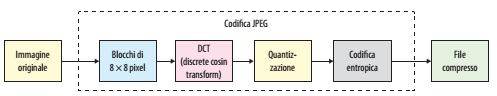

</div>

**Fasi:** immagine originale → **blocchi di 8 × 8 pixel** → **DCT** (trasformata coseno discreta) → **quantizzazione** → **codifica entropica** → **file compresso**.

*La fase che "butta via" informazione è la quantizzazione.*

---

## JPEG: qualità e dimensione

<div class="center">

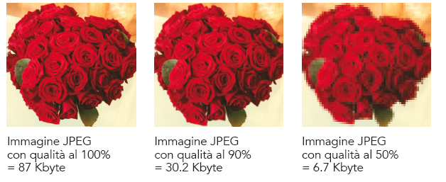

</div>

| Qualità | Dimensione |
|:---:|:---:|
| 100% | 87 KB |
| 90% | 30,2 KB |
| 50% | 6,7 KB |

Abbassando la qualità il file **si riduce molto**, ma compaiono **artefatti** (blocchetti visibili).

---

<!-- _class: section-break -->

# 6. Immagini vettoriali

---

## Immagine vettoriale

Una particolare rappresentazione delle immagini è quella **vettoriale** (*vector*).

- Si usa per immagini **geometriche** o riconducibili a insiemi di **forme** (punti, linee, rettangoli, cerchi)
- **Non viene memorizzata l'immagine**, ma il **procedimento per costruirla**

**Doppio vantaggio**
1. **diminuisce enormemente** l'occupazione di memoria
2. le immagini sono facilmente **ridimensionabili** senza perdere qualità

---

## Vettoriale: cosa si memorizza?

<div class="center">

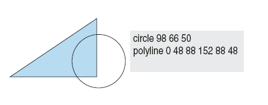

</div>

Invece dei pixel si memorizzano **comandi** come:

```text
circle   98 66 50            ← cerchio: centro (98, 66), raggio 50
polyline 0 48 88 152 88 48   ← poligonale con i vertici indicati
```

**Esempio in SVG:**

```xml
<circle cx="98" cy="66" r="50" fill="none" stroke="black"/>
```

---

## Immagini vettoriali: curve e riempimenti

<div class="center">

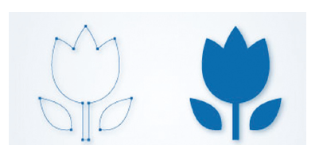

</div>

A sinistra i **punti di controllo** e le **curve** (contorno); a destra l'immagine con **riempimento** di colore. Modificando un punto di controllo cambia la forma, senza perdite di qualità.

---

## Formati vettoriali

Ricordiamo i seguenti formati:

| Formato | Uso |
|:---:|---|
| **DXF** (*Drawing Exchange Format*) | strumenti di disegno tecnico |
| **DWG** | utilizzato da **AutoCAD** |
| **CDR** | utilizzato da **Corel Draw** |
| **AI** | **Adobe Illustrator** |
| **WMF** (*Windows MetaFile*) | grafica Windows |
| **SVG** (*Scalable Vector Graphics*) | nativo in quasi tutti i **browser** moderni |

---

## Rasterizzazione (rendering)

Il processo di **visualizzazione** di un'immagine vettoriale (cioè la trasformazione da **codifica matematica** a **codifica raster**) è detto **rasterizzazione** o **rendering**.

<div class="center">

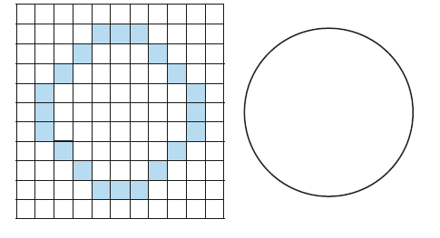

</div>

A sinistra un cerchio **raster** (griglia di pixel), a destra lo stesso cerchio **vettoriale** (formula matematica).

Ogni volta che si apre un SVG, il computer lo **converte in pixel** per mostrarlo sullo schermo.

---

## Raster vs vettoriale

Riassumendo, le principali differenze:

| | Raster | Vettoriale |
|---|---|---|
| **Dimensione** | in genere maggiore | in genere minore |
| **Scalabilità** | **perde qualità** (pixel visibili) | **nessuna perdita** |
| **Caratteristiche visive** | forme complesse, sfumature (foto) | forme semplici, colori piatti (loghi) |
| **Conversione** | vettorializzare è **difficile** | **rasterizzare è diretto** |
| **Formati** | JPEG, PNG, GIF, BMP | SVG, AI, DXF, DWG |

**Regola pratica:** foto → raster · loghi, icone, disegni tecnici → vettoriale.

---

## Esempio riepilogativo: un film di un'ora

<div class="center">

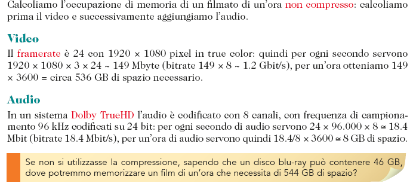

</div>

**Video** (non compresso): 1920 × 1080 × 3 byte × 24 fotogrammi/s ≈ **149 MB/s** → × 3600 s ≈ **536 GB**
**Audio** (Dolby TrueHD, 8 canali, 96 kHz, 24 bit) ≈ **8 GB**
**Totale ≈ 544 GB**, contro i **46 GB** di un disco Blu-ray → serve la compressione (circa **12 volte** più piccola).

---

## Esercizi svolti

**1.** Quanti colori con **12 bit** per pixel? → 2¹² = **4096**

**2.** Peso di un'immagine **1024 × 768** a **256 colori**?
256 colori = 8 bit = 1 byte → 786 432 × 1 = **786 432 byte** = 768 KiB

**3.** Quanti pixel ha una stampa **A4** (29,7 × 21 cm) a **300 DPI**?
29,7/2,54 ≈ 11,69 in → 11,69 × 300 ≈ 3508 · 21/2,54 ≈ 8,27 in → 2480 → **3508 × 2480**

**4.** Comprimere con RLE `AAAABBBCCCCCD`:
→ **4A 3B 5C 1D**

**5.** Un video **1280 × 720** True color a 25 fps: dati al secondo?
1280 × 720 × 3 × 25 = **69 120 000 byte/s** ≈ 69 MB/s

---

## Esercizi per casa

1. Calcola il peso non compresso di un'immagine **800 × 600** in: **a)** bianco e nero, **b)** 256 grigi, **c)** True color.
2. Con **5 bit** per pixel quanti colori si possono rappresentare? Quanti bit servono per **1000 colori**?
3. Una foto viene stampata **10 × 15 cm a 300 DPI**: quanti pixel servono? Qual è il peso in True color?
4. Codifica in **RLE** la sequenza `BBBBWWWWWWBBWWWW`.
5. Spiega la differenza tra **PPI** e **DPI** con un esempio.
6. Perché un **logo** aziendale è meglio in **SVG** che in **JPEG**?
7. Spiega la differenza tra compressione **lossless** e **lossy** e indica un formato per ciascuna.

*Soluzioni parziali:* 1a) 60 000 B · 1b) 480 000 B · 1c) 1 440 000 B · 2) 32 colori; 10 bit · 3) 1181 × 1772 px; 6 278 196 B ≈ 6 MB · 4) `4B 6W 2B 4W`

---

## Riepilogo

- Le immagini si digitalizzano con **campionamento** (pixel) e **quantizzazione** (numeri)
- **1 bit** = B/N · **8 bit** = 256 grigi · **24 bit (RGB)** = True color (16,7 milioni di colori)
- **Peso = larghezza × altezza × profondità**
- **PPI** (video) e **DPI** (stampa): densità di pixel per pollice (1 in = 2,54 cm)
- **SD** 4:3, **HD** 16:9; **i** = interlacciata, **p** = progressiva
- **Lossless** (ZIP, PNG, RLE) senza perdita · **Lossy** (JPEG) con perdita
- **Vettoriale**: si memorizza il procedimento, scalabile e leggero (SVG, AI, DXF)

---

<!-- _class: title -->
<!-- _paginate: false -->
<!-- _header: '' -->
<!-- _footer: '' -->

# Grazie per l'attenzione

**Domande?**

Prossima lezione: suoni e filmati (multimedialità, parte 2)
