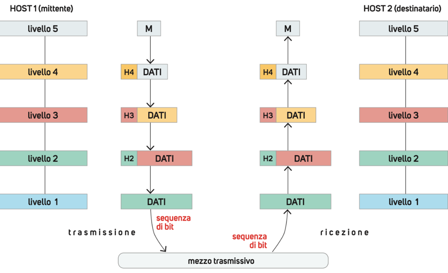
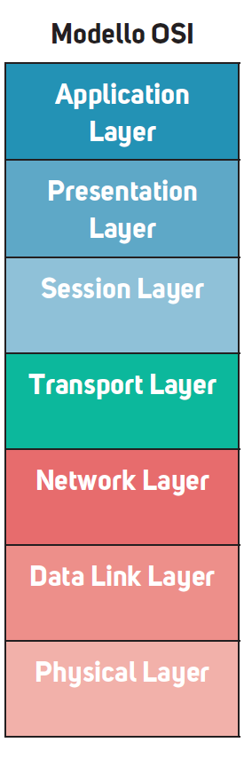
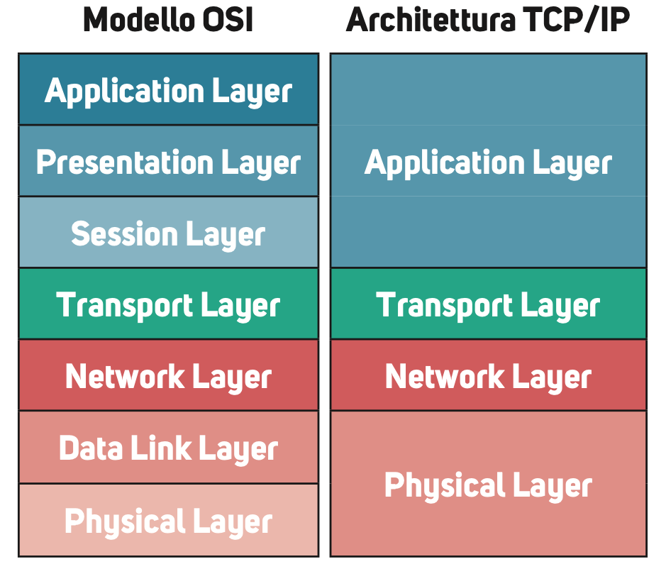
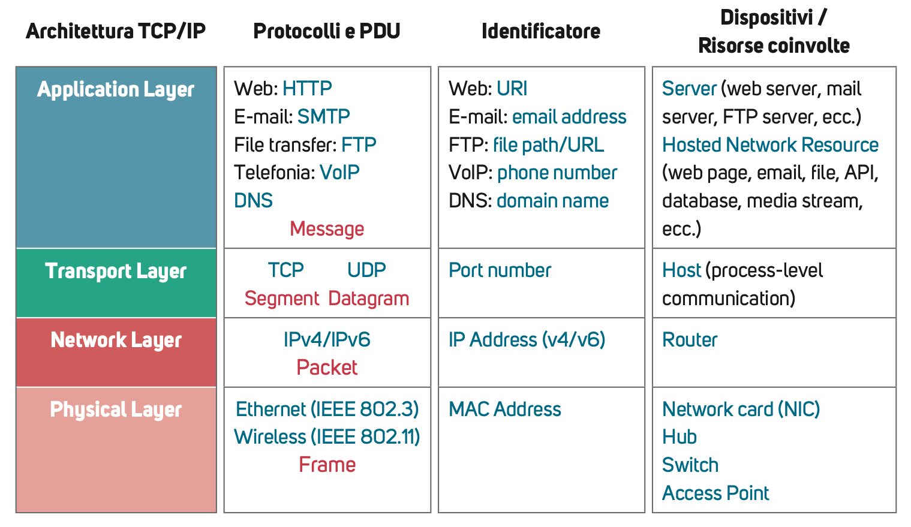
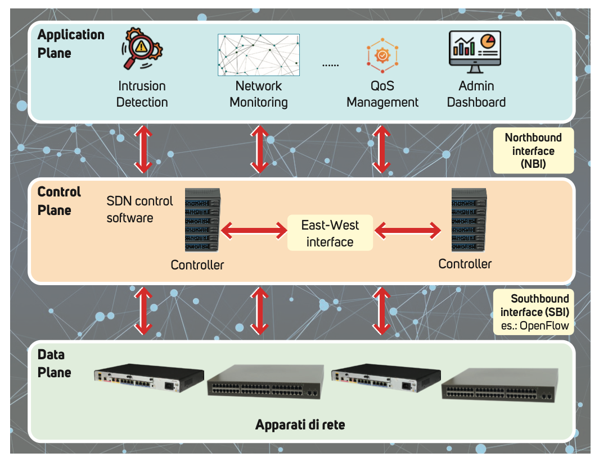

<!-- _class: lead -->

# Le architetture e gli standard delle reti

### Unità 1 — Internetworking

**Sistemi e Reti — Classe Quarta — Istituto Tecnico Informatico**

**Prof. Dicara**

---

## In questa lezione impareremo

- perché le reti si progettano a **livelli (layer)** e cosa sono protocolli, servizi e primitive
- il principio dell'**incapsulamento** e il concetto di **PDU**
- la struttura del **modello ISO/OSI** a sette livelli
- lo **stack TCP/IP** e il confronto con il modello OSI
- i fondamenti dell'architettura **SDN** (Software-Defined Network)
- i principali **enti di standardizzazione** delle telecomunicazioni

> Obiettivo: comprendere perché "spezzare" il problema della comunicazione in rete in livelli indipendenti rende le reti moderne interoperabili, modulari e più facili da evolvere.

---

## Introduzione

Le reti di telecomunicazioni permettono la connessione e lo scambio di dati tra numerosi dispositivi, utilizzando architetture e protocolli standardizzati come i modelli **OSI** e **TCP/IP**.

- un'architettura di rete ben progettata assicura **prestazioni elevate** e facilita l'integrazione di nuove tecnologie;
- gli **standard internazionali** garantiscono **interoperabilità** tra apparati e produttori diversi, prevenendo conflitti e favorendo l'evoluzione efficiente delle reti.

<div class="example">

💡 **Esempio concreto**: grazie agli standard, uno smartphone Samsung può collegarsi senza problemi a un router Wi-Fi TP-Link, scambiare email con un server Microsoft e visitare un sito ospitato su Linux: tutti "parlano" gli stessi protocolli standardizzati (TCP/IP, HTTP, DNS…).

</div>

---

<!-- _class: lead -->

# I modelli e le architetture di rete

---

## Organizzare la complessità

Per trasmettere e condividere dati tra due macchine a distanza sono state ideate le **reti**. Una rete è un sistema complesso che presenta numerose problematiche:

- la scelta dei **dispositivi**;
- la **gestione degli errori**;
- la **stabilità** del sistema;
- la **sicurezza**…

Per semplificare la gestione si sviluppano **moduli indipendenti** che cooperano per trasmettere dati da un host mittente a un host destinatario: si usa il **modello a livelli (layer)**, analogo al modello **top-down**, che scompone un problema complesso in problemi più semplici.

<div class="example">

💡 **Analogia**: è lo stesso principio con cui un'azienda organizza reparti (amministrazione, produzione, logistica…): ogni reparto ha compiti specifici e comunica con gli altri tramite procedure standard, senza dover conoscere il funzionamento interno degli altri reparti.

</div>

---

## Il modello a livelli: peer entity e peer level

Il modello a livelli è solitamente rappresentato in verticale. Due host che vogliono comunicare realizzano la **stessa architettura a livelli**:

- il **livello N** del mittente comunica con il **livello N** del destinatario, tramite uno o più protocolli;
- questi livelli "corrispondenti" si chiamano **peer level**;
- ogni elemento in grado di inviare/ricevere informazioni si dice **entità (entity)**;
- le entità corrispondenti sui due host si chiamano **peer entity**.

> Un **protocollo** è un insieme di regole che definiscono la comunicazione tra due peer entity (ad esempio, tra il livello Transport del mittente e il livello Transport del destinatario).

---

## Il modello a livelli: caratteristiche

Nel modello a livelli:

- ogni livello offre un servizio **più astratto** procedendo dal basso verso l'alto;
- ogni livello svolge **funzioni specifiche** e, insieme agli altri, realizza la comunicazione tra sistemi;
- la rete è **modulare**: grazie alla suddivisione in livelli e all'uso di **interfacce**, è possibile modificare un livello senza influire sugli altri, purché l'interfaccia resti invariata.

Le interfacce sono definite tramite **primitive**, usate per richiedere (in trasmissione) o ricevere (in ricezione) servizi tra livelli adiacenti. Le primitive sono descritte da parametri come i **dati da trasferire**, il **destinatario** e il **tipo di servizio** richiesto.

<div class="example">

💡 **Esempio**: se in futuro il livello Fisico passa dal cavo Ethernet al Wi-Fi, i livelli superiori non devono cambiare, perché l'interfaccia verso il Data Link resta la stessa: è il vantaggio della modularità.

</div>

---

## Attenzione! Funzioni, servizi e primitive

Non vanno confusi questi tre concetti:

| Concetto | Definizione | Esempio |
|---|---|---|
| **Funzione** | operazione svolta **dentro** un livello | ritrasmissione di un pacchetto smarrito |
| **Servizio** | offerto **sull'interfaccia** tra livelli adiacenti | individuazione del percorso migliore |
| **Primitiva** | permette di **attivare** un servizio | richiesta di invio dei dati |

<div class="example">

💡 **Analogia con la posta**: la funzione è "smistare le lettere nel centro postale"; il servizio è "consegna a domicilio" offerto al cliente; la primitiva è l'atto di "imbucare la lettera", cioè l'azione con cui il cliente richiede il servizio.

</div>

---

## Esempio di primitive: il servizio di connessione

Lo scambio di primitive avviene sia tra livelli adiacenti sullo stesso host, sia tra peer level durante una procedura di **connessione logica** tra due host:

1. **Connect Request**: comando di richiesta del servizio di connessione (con parametri, es. l'host a cui connettersi);
2. **Connect Indication**: segnalazione di richiesta di connessione ricevuta dall'host destinatario;
3. **Connect Response**: risposta del destinatario (positiva o negativa);
4. **Connect Confirm**: segnalazione della risposta al mittente.

```
Host A                                          Host B
  │── Connect Request ────────────────────────▶│
  │                                Connect Indication (interno)
  │                                  ◀── decide se accettare
  │◀─────────────────────── Connect Response ───│
Connect Confirm (interno)
  │                                              │
```

---

## L'incapsulamento

L'**incapsulamento** è il principio base del modello a livelli:

- quando il messaggio (**M**) viene inviato dall'host mittente, **ogni livello aggiunge un proprio header** contenente informazioni necessarie alle sue funzioni;
- il pacchetto risultante (header + dati) viene passato al livello inferiore, fino al livello fisico.

<div class="example">

📌 **Esempio**: in trasmissione, il messaggio inviato dal livello 4 al livello 3 è formato dai dati ricevuti dal livello 5 (**M**) più l'header aggiunto dal livello 4 (**H4**). L'insieme **H4 + M** diventa un unico pacchetto dati inviato al livello 3, che a sua volta aggiungerà il proprio header H3, e così via.

💡 È come imbustare una lettera dentro un'altra busta più grande a ogni passaggio: ogni "busta" (header) contiene le istruzioni per quel particolare passaggio della spedizione, mentre il contenuto originale resta intatto all'interno.

</div>

---

## Incapsulamento e decapsulamento



In **ricezione**, quando un livello riceve un pacchetto dal livello inferiore, estrae i byte del proprio header (contenenti informazioni utili alla sua elaborazione) e ignora il resto; se il messaggio risulta corretto, i dati **senza il proprio header** vengono passati al livello superiore.

---

## Protocol Data Unit (PDU)

Il messaggio scambiato tra peer entity, formato da **header + dati**, si chiama **Protocol Data Unit (PDU)**.

- la PDU è **specifica di un livello**: la PDU del generico livello N si indica come **N-PDU**;
- lo standard che definisce un protocollo specifica anche il **formato della sua PDU**.

<div class="example">

💡 **Esempio di nomi di PDU** (li rivedremo nei livelli OSI/TCP-IP): a livello Transport la PDU si chiama **segment** (TCP) o **datagram** (UDP); a livello Network si chiama **packet**; a livello Data Link si chiama **frame**; a livello Physical è semplicemente una **sequenza di bit**.

</div>

---

## Progettare un'architettura di rete

La progettazione di un'architettura di rete per la comunicazione tra computer richiede di indicare:

1. il **modello di riferimento** dello schema concettuale — se si sceglie il modello a livelli, va indicato il **numero di livelli** coinvolti;
2. il **servizio** che ciascun livello offre al livello adiacente superiore (es. la connessione);
3. le **funzioni** svolte da ogni livello per realizzare il servizio (es. la rilevazione degli errori di trasmissione);
4. le **specifiche formali** dei protocolli, delle interfacce e delle primitive, per spiegare come ogni livello fornisce il suo servizio.

Questi quattro punti sono esattamente ciò che troveremo, nel dettaglio, nel modello **ISO/OSI** e nello stack **TCP/IP**.

---

<!-- _class: lead -->

# Il modello ISO/OSI

---

## Storia e obiettivi del modello OSI

L'**ISO** (International Organization for Standardization) definì nel **1978** il modello **OSI** (Open Systems Interconnection) per standardizzare l'interconnessione tra computer.

- il termine **open** indica l'obiettivo di garantire **interoperabilità** tra dispositivi di produttori diversi;
- il modello fu formalizzato nel documento **ISO 7498** del **1984** (*Basic Reference Model*) e aggiornato negli anni con nuove funzioni (es. sicurezza);
- il modello ISO/OSI suddivide in **sette livelli** le funzionalità necessarie a realizzare reti di computer.

> 🔎 Nota storica: il modello OSI nacque come proposta di standard **completo e ufficiale**, ma nella pratica è stato lo stack **TCP/IP** (più semplice, nato da ARPANET) ad affermarsi come standard di fatto di Internet. L'OSI resta però fondamentale come **modello didattico e di riferimento**.

---

## I sette livelli del modello OSI



- i primi tre livelli sono i **lower layers** (o *network oriented layers*): riguardano la rete;
- il quarto livello (**Transport**) separa l'ambiente rete dall'ambiente applicazione;
- gli ultimi tre livelli sono gli **upper layers** (o *application oriented layers*): riguardano l'applicazione.

---

## La comunicazione tra due host nel modello OSI

I dati inviati dall'applicazione dell'host mittente (**HOST1**) passano attraverso i vari livelli, che aggiungono progressivamente il proprio header (**incapsulamento**).

Quando i dati arrivano al computer di destinazione (**HOST2**), il messaggio viene **decapsulato**: ogni livello analizza il proprio header e passa al livello superiore solo la parte dati (**payload**).

- i **primi tre livelli** del modello OSI gestiscono la comunicazione **di rete e inter-rete**;
- i **quattro livelli superiori** controllano la comunicazione **end-to-end** (tra i due host finali, indipendentemente dal percorso di rete attraversato).

---

## Livello 1 — Physical layer

Deve trasmettere una sequenza di **bit** attraverso un mezzo fisico.

**Compiti:**
- definire le caratteristiche fisiche delle interfacce tra gli apparati;
- rappresentare come i bit (0 e 1) si trasformano in un **segnale** (elettrico, ottico o radio) da trasmettere;
- definire la **velocità di trasmissione** (bit al secondo);
- realizzare la **topologia fisica** della rete che connette i dispositivi.

**Apparati**: schede di rete (**NIC**) e **hub**.

<div class="example">

💡 **Esempio**: un cavo Ethernet Cat6 e la relativa scheda di rete traducono i bit "1" e "0" in impulsi elettrici a diversi livelli di tensione; una fibra ottica li traduce in impulsi di luce.

</div>

---

## Livello 2 — Data Link layer

Deve garantire l'**affidabilità del collegamento fisico**, in modo che sia privo di errori. Utilizza l'**indirizzamento fisico** (es. il **MAC Address**) per gestire la trasmissione tra due host della stessa rete.

**Compiti:**
- dividere il flusso di bit dal livello Network in PDU dette **frame**, aggiungendo l'header con mittente e destinatario;
- **controllare il flusso** dei dati, per prevenire la congestione del ricevente;
- garantire l'affidabilità del livello fisico, individuando frame danneggiati o persi;
- controllare l'**accesso** di più dispositivi allo stesso canale di comunicazione.

**Apparati**: access point, bridge e **switch**.

---

## Livello 3 — Network layer

Deve **instradare** correttamente il pacchetto dal mittente al destinatario, attraverso reti diverse (se mittente e destinatario sono sulla stessa rete, basta il livello Data Link).

**Compiti:**
- suddividere il messaggio dal livello Transport in PDU dette **packet** o **datagram**;
- gestire l'**indirizzamento logico**, per individuare univocamente mittente e destinatario su rete WAN (es. l'indirizzo **IP**);
- **instradare (routing)** i pacchetti quando il percorso attraversa più reti, collegando reti indipendenti in una **Internetwork** (una "rete di reti").

**Apparati**: **router**.

---

## Livello 4 — Transport layer

È responsabile della consegna del messaggio da mittente a destinatario: comunicazione **end-to-end (E2E)**. Grazie a questo lavoro, il livello superiore (Session) opera come se ci fosse una linea diretta tra i due host.

**Compiti:**
- consegnare il messaggio al **processo destinatario**, usando i **numeri di porta**;
- **segmentare** ogni messaggio e assegnare un **numero di sequenza** a ogni segmento, per ricostruire il messaggio e individuare segmenti persi o duplicati;
- offrire controllo di connessione **connection-oriented** o **connectionless** (in quest'ultimo caso non è garantita la consegna corretta);
- controllo di **flusso** e di **errore**.

<div class="example">

💡 Sono i protocolli **TCP** (connection-oriented, affidabile) e **UDP** (connectionless, veloce ma senza garanzie) che opereranno proprio a questo livello nello stack TCP/IP.

</div>

---

## Livello 5 — Session layer

Controlla la comunicazione in rete: **apre, gestisce e sincronizza** le interazioni tra i sistemi coinvolti.

**Compiti:**
- **controllo del dialogo**: il dialogo viene suddiviso in **sessioni**, che possono essere interrotte e riprese successivamente;
- **sincronizzazione**: si inseriscono **checkpoint** (punti di sincronizzazione) in un flusso di dati, per suddividerlo in unità più piccole riscontrate in modo indipendente; in caso di mancata ricezione, viene ritrasmessa **solo l'unità mancante**.

<div class="example">

💡 **Esempio**: durante il download di un file molto grande che si interrompe, grazie ai checkpoint di sessione non è necessario ripartire da zero, ma solo dall'ultimo punto di sincronizzazione raggiunto.

</div>

---

## Livello 6 — Presentation layer

Controlla la correttezza **sintattica e semantica** delle informazioni scambiate tra i due host.

**Compiti:**
- **traslazione**: le informazioni alfanumeriche scambiate dai processi applicativi vengono convertite in flussi di bit; il formato passa dalla sintassi locale del mittente a una **sintassi di trasferimento comune**, e viceversa in ricezione;
- **crittografia**: se richiesto, i dati vengono cifrati prima dell'invio e decifrati in ricezione;
- **compressione**: per flussi di grandi dimensioni (es. audio/video), riduce la quantità di bit da inviare.

<div class="example">

💡 **Esempio**: la codifica dei caratteri (es. da **UTF-8** a un altro formato), la cifratura **TLS/SSL** usata da HTTPS, o la compressione di un video in streaming avvengono concettualmente a questo livello.

</div>

---

## Livello 7 — Application layer

Fornisce il supporto ai servizi di rete offrendo un'**interfaccia utente** (un utente umano, oppure un processo software).

I servizi di rete possono essere, ad esempio: **posta elettronica**, **trasferimento file**, **terminale remoto**, **risoluzione dei nomi (DNS)**, ecc.

> ⚠️ **Attenzione**: a questo livello **non si aggiunge un header** al messaggio da inviare in rete — è il livello più "vicino" all'utente/applicazione, il punto di partenza dei dati da incapsulare.

<div class="example">

💡 **Esempio pratico completo**: quando apri il browser e visiti un sito, l'Application layer gestisce **HTTP**; il Presentation layer si occupa della cifratura **TLS** (HTTPS); il Session layer mantiene la sessione di navigazione attiva; il Transport layer (**TCP**) garantisce la consegna dei dati; il Network layer (**IP**) instrada i pacchetti; il Data Link e il Physical layer si occupano della trasmissione fisica sul cavo o Wi-Fi.

</div>

---

<!-- _class: lead -->

# Lo stack TCP/IP

---

## Storia dello stack TCP/IP

**Vinton Gray Cerf** e **Robert Elliot Kahn** pubblicarono nel **1974**, sulla rivista *IEEE Transactions on Communications*, l'articolo *"A Protocol for Packet Network Intercommunication"*, che descriveva il **Transmission Control Protocol (TCP)**: supportava l'interconnessione di reti *packet switched* in una "rete delle reti", la futura **Internet**.

- il TCP venne poi suddiviso in due protocolli: **TCP** e **IP** (Internet Protocol);
- nel **1983**, TCP/IP divenne lo standard della rete **ARPANET**, che collegava università, laboratori di ricerca ed enti militari;
- nel **1984** venne scorporata la componente militare (**MILNET**); ARPANET continuò a operare fino al **1990**, quando si fuse con Internet.

Si parla spesso di **Internet protocol suite** o **Internet protocol stack** ("pila protocollare di Internet"), detto anche **stack TCP/IP**.

---

## I livelli di TCP/IP

- **Network Access Layer** (Physical layer): gestisce l'accesso ai diversi tipi di rete; include le funzioni dei livelli Physical, Data Link e parte del Network di OSI.
- **IP Layer** (Network layer): si occupa dell'instradamento dei pacchetti e dell'interconnessione tra reti; include le funzioni del livello Network di OSI e il servizio *connectionless*.
- **TCP Layer** (Transport layer): gestisce le connessioni end-to-end, includendo i protocolli **TCP** (connection-oriented) e **UDP** (connectionless); corrisponde al livello Transport di OSI.
- **Application Layer**: fornisce i servizi applicativi di Internet; corrisponde agli ultimi tre livelli del modello OSI (Session, Presentation, Application).

---

## Confronto OSI vs TCP/IP



Lo stack TCP/IP ha **4 livelli** invece di 7: alcune funzioni dei livelli OSI Session/Presentation/Application sono "assorbite" in un unico **Application Layer**, mentre Physical e Data Link sono spesso accorpati nel **Network Access Layer**.

---

## L'evoluzione di TCP/IP

Nel 1983 TCP/IP divenne l'architettura ufficiale di Internet, evolvendosi poi in diverse versioni:

- **Versione 4 (IPv4)**: ancora molto diffusa, usa indirizzi a **32 bit**; la rapidissima diffusione di Internet ha però causato una **carenza di indirizzi** disponibili;
- **Versione 5**: proposta basata sul modello OSI, **mai adottata** per l'elevato costo delle modifiche richieste;
- **Versione 6 (IPv6)**: introduce indirizzi a **128 bit**, permettendo di gestire un numero **quasi illimitato** di utenti/dispositivi.

<div class="example">

💡 **Perché serve IPv6?** Con 32 bit, IPv4 offre "solo" circa 4,3 miliardi di indirizzi univoci: un numero insufficiente rispetto ai miliardi di smartphone, PC, sensori IoT e altri dispositivi connessi oggi a Internet. IPv6 offre $2^{128}$ indirizzi, un numero enorme, praticamente inesauribile.

</div>

---

## Livelli, protocolli, dispositivi: una visione d'insieme



Questa tabella riassume, per ogni livello TCP/IP: i **protocolli** e le **PDU** coinvolte, gli **identificatori** usati (es. indirizzo IP, MAC Address, numero di porta) e i **dispositivi/risorse** tipici di quel livello.

---

<!-- _class: lead -->

# L'evoluzione delle architetture di rete: la SDN

---

## Software-Defined Network (SDN)

Il modello OSI e l'architettura TCP/IP restano **fondamentali** per il networking, ma l'evoluzione delle reti ha introdotto una nuova architettura: la **Software-Defined Network (SDN)**, in cui il controllo passa al **software** invece che agli apparati di rete tradizionali.

L'architettura SDN **divide il controllo della rete dai dispositivi fisici**, permettendo di programmare le reti in modo **centralizzato**. Questo semplifica l'**automazione** delle funzioni di rete, con vantaggi in termini di gestione e flessibilità.

<div class="example">

💡 **Perché è importante**: in una rete tradizionale, per cambiare una regola di instradamento bisogna configurare manualmente ogni singolo router/switch. In una rete SDN, un amministratore modifica una policy sul **controller centrale**, che la applica automaticamente a tutti i dispositivi coinvolti.

</div>

---

## L'architettura SDN a tre livelli



- **Data plane** (o *Forwarding plane*): la struttura fisica della rete; comunica con il livello di controllo tramite API per ricevere regole di invio dati e trasmettere lo stato della rete.
- **Control plane**: i **controller SDN**, il software che offre una visione centralizzata e un controllo dinamico dell'intera rete; applica le **policy** definite dagli amministratori.
- **Application plane**: applicazioni e servizi per gli utenti; stabilisce le policy che guidano il control plane (es. **QoS** — *Quality of Service* — per dare priorità alle app di videoconferenza).

---

## Le interfacce della SDN

La comunicazione tra i tre livelli avviene tramite **API** (Application Program Interface):

**Northbound interface**
- collega il livello di controllo alle applicazioni;
- il controller SDN gestisce automaticamente il traffico secondo le policy e ottimizza i percorsi;
- le API sono spesso **RESTful** (scambio sicuro di informazioni tra sistemi via Internet).

**Southbound interface**
- collega il livello di controllo all'infrastruttura di rete;
- permette al controller di modificare in **tempo reale** l'instradamento di router e switch, per ottimizzare i flussi di dati.

> 🔎 Come si vede nello schema precedente, esiste anche una **East-West interface**, che collega più controller SDN tra loro per garantire scalabilità e ridondanza in reti di grandi dimensioni.

---

## Controller SDN e protocollo OpenFlow

**OpenFlow** è un protocollo standard usato dai controller SDN per comunicare con gli apparati di rete.

- il controller SDN definisce le regole di instradamento e le politiche di rete, inviate tramite OpenFlow agli apparati, che le memorizzano in tabelle chiamate **flow table**;
- ogni *entry* di una flow table contiene tre elementi principali:
  - i **match field**: individuano i pacchetti corrispondenti alla regola;
  - dei **contatori**: registrano l'uso della regola;
  - le **istruzioni**: azioni da applicare ai pacchetti corrispondenti.

Quando un pacchetto arriva a un apparato di rete, questo lo confronta con le regole della propria tabella e, se trova corrispondenza, applica l'azione indicata (es. **inoltro, blocco, modifica, duplicazione**).

---

## TCP/IP e SDN: due architetture complementari

L'architettura **TCP/IP** rimane alla base delle reti moderne. L'**SDN non la sostituisce**, ma la **integra**, rendendola più flessibile e automatizzando operazioni come la configurazione di router e switch.

- le due architetture possono **coesistere**, poiché sono complementari;
- in questo corso faremo riferimento principalmente al modello **TCP/IP tradizionale**, su cui si fondano Internet e le reti locali attuali.

<div class="example">

💡 In pratica: i pacchetti che viaggiano su una rete SDN sono comunque pacchetti **IP** instradati secondo le stesse regole di sempre; ciò che cambia è **chi decide** le regole di instradamento (un software centralizzato, anziché la configurazione manuale di ogni singolo apparato).

</div>

---

<!-- _class: lead -->

# Gli enti di standardizzazione

---

## ITU-T e ISO

**ITU-T** — *International Telecommunication Union – Telecommunication Standardization Sector*
🔗 https://www.itu.int/en/Pages/default.aspx

È l'organismo che produce standard internazionali per i sistemi di trasmissione, le reti ottiche, i sistemi multimediali e audiovisivi, le reti dati e la sicurezza.

**ISO** — *International Organization for Standardization*
🔗 https://www.iso.org/

Si occupa di una vasta gamma di standard nei campi scientifico, tecnologico ed economico. Nell'ambito delle telecomunicazioni, si differenzia da ITU-T perché più focalizzato sull'**information technology**.

---

## IETF e IEEE

**IETF** — *Internet Engineering Task Force*
🔗 https://www.ietf.org/

È l'organismo operativo dello **IAB** (*Internet Architecture Board*), l'ente che supervisiona il processo di creazione degli standard tecnologici per Internet.

**IEEE** — *Institute of Electrical and Electronics Engineers*
🔗 https://www.ieee.org/

Definisce standard nei settori dell'ingegneria elettronica, informatica e delle telecomunicazioni. In ambito networking, il progetto **802.X** definisce un insieme di standard per LAN e MAN, relativamente al livello Physical di TCP/IP (es. **802.3** Ethernet, **802.11** Wi-Fi).

---

## 3GPP ed ETSI

**3GPP** — *3rd Generation Partnership Project*
🔗 https://www.3gpp.org/

Nato per produrre le specifiche tecniche del sistema mobile **3G**. Con l'avvento delle tecnologie **LTE** e **5G**, il 3GPP è diventato l'organizzazione internazionale di riferimento per i sistemi mobili oltre il 3G.

**ETSI** — *European Telecommunications Standards Institute*
🔗 https://www.etsi.org/

Organizzazione non-profit il cui obiettivo è la definizione degli standard di telecomunicazione a **livello europeo**; è partner dell'associazione 3GPP.

---

## Una proposta di attività sugli standard

Ogni ente di standardizzazione dispone di un sito web (generalmente in inglese) che pubblica informazioni, documenti e aggiornamenti sulle proprie attività: sono fondamentali per produttori, fornitori di servizi e operatori del settore.

**Prova ad analizzare i siti dei principali organismi di standardizzazione e approfondisci:**

- **Norme di pubblicazione**: come vengono numerati, scritti, aggiornati e distribuiti gli standard? Sono gratuiti o a pagamento?
- **Processo di standardizzazione**: come operano i gruppi di lavoro, quali procedure seguono, come una bozza diventa uno standard ufficiale?
- **Nuovi standard**: quali aggiornamenti o nuovi standard sono in sviluppo, e chi partecipa alla loro definizione (provider, produttori, utenti)?
- **Collaborazioni**: sono previsti accordi o progetti con altri enti, forum o organizzazioni di utenti?

---

## Riepilogo

- una rete è gestita tramite un **modello a livelli**: ogni livello offre servizi al livello superiore tramite **interfacce** e **primitive**, seguendo un **protocollo** condiviso con il livello "pari" (peer level) dell'altro host;
- il principio dell'**incapsulamento** aggiunge un header a ogni livello, producendo una **PDU** specifica (frame, packet, segment…);
- il modello **ISO/OSI** organizza la comunicazione in **7 livelli**; lo stack **TCP/IP**, più snello (4 livelli), è lo standard di fatto di Internet;
- la **SDN** separa il piano di controllo (software) dal piano dati (hardware), rendendo le reti più flessibili e automatizzabili, senza sostituire TCP/IP;
- enti come **ISO, ITU-T, IETF, IEEE, 3GPP, ETSI** garantiscono che apparati di produttori diversi possano interoperare, definendo standard condivisi a livello mondiale ed europeo.

---

<!-- _class: lead -->

# Fine Unità 1

### Prossima unità: indirizzamento IP e subnetting

**Domande?**

**Prof. Dicara**
